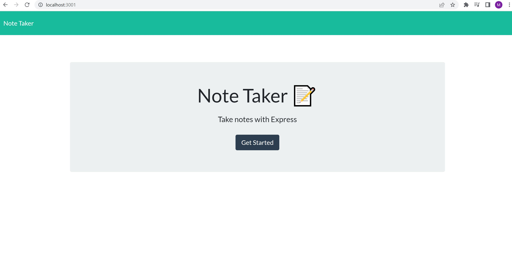
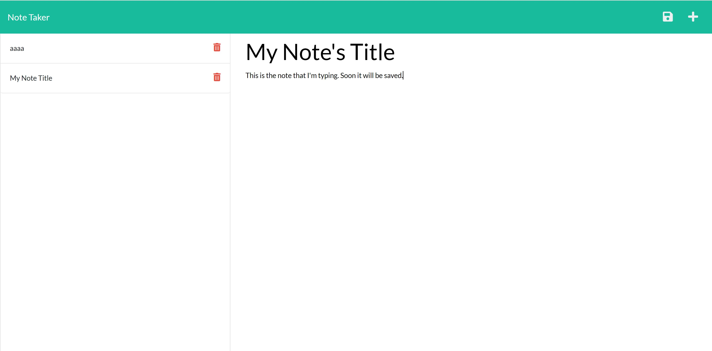
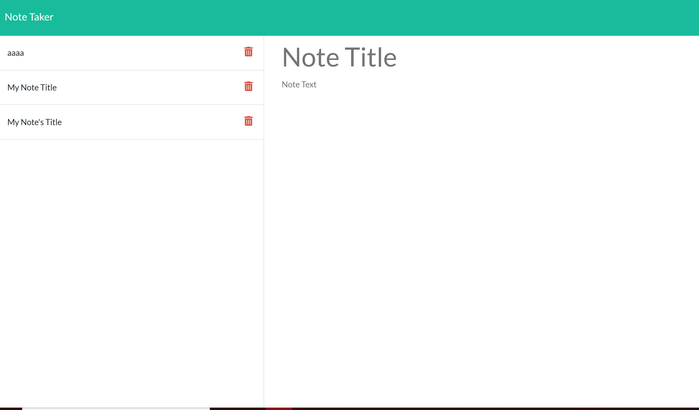

Note Taker

GitHub Repository: https://github.com/mlfitz2/Note-Taker
Deployed App: https://mikes-note-taking-app.herokuapp.com/notes

This program is a note-taking app, which allows the user to enter a note and its title, and then save it for future reference. Notes can also be deleted by the user. 

The application uses JavaScript, Node, Express, CSS and HTML to run. The user's data is stored in a JSON database, following a route defined by JavaScript. Using Express, the app displays the appropriate HTML file of the homepage, and then the note-taking page by using "router.get" to define the HTML files that should be displayed. "Router.post" and "router.delete" are used to add and delele the user's info from the database. 

